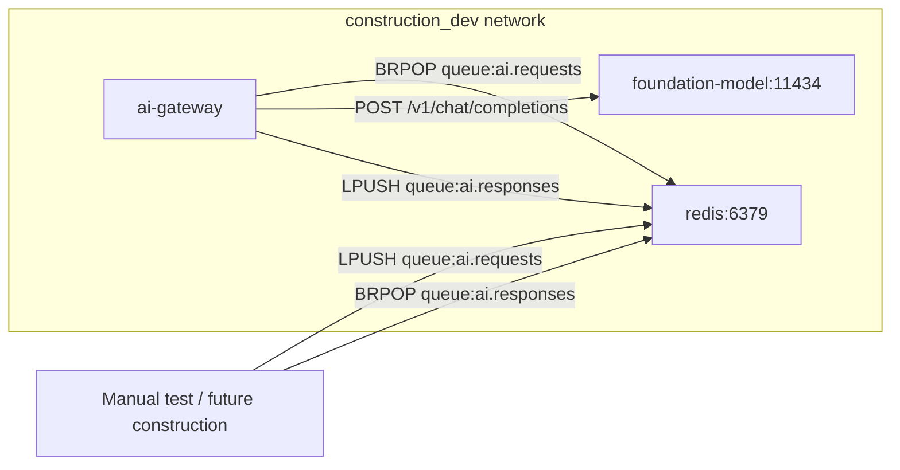
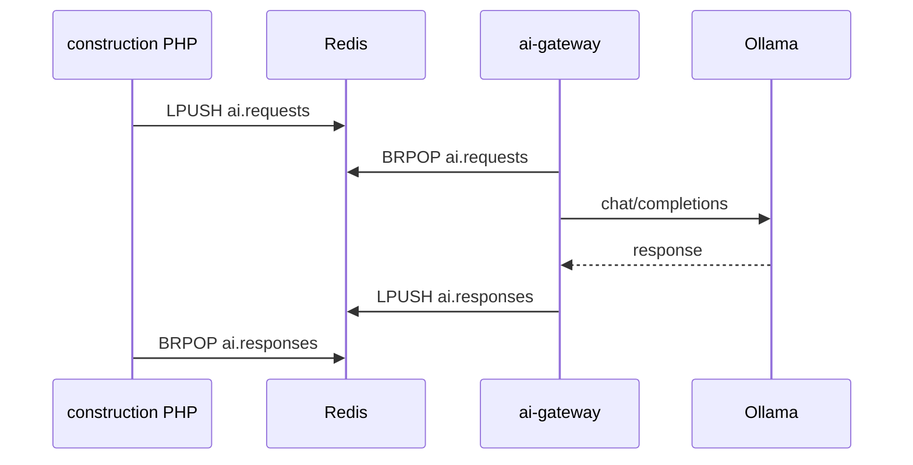

# AI Gateway — Dummy Container Setup

## Context

The [construction](/home/michel/Project/construction) project already uses Redis list queues with a CloudEvents derivative ([`CloudEvent.php`](/home/michel/Project/construction/src/Domain/Shared/Queue/CloudEvent.php), [ADR-0002](/home/michel/Project/construction/feature/adr/0002-redis-async-queues.md)):

- Keys: `queue:{name}` (e.g. `queue:website.translations`)
- Pattern: `LPUSH` to publish, `BRPOP` to consume
- Ollama runs as `foundation-model` on `http://foundation-model:11434` (OpenAI-compatible `/v1/chat/completions`)
- Docker network: compose network `dev` → runtime name **`construction_dev`**

[`construction-ai-gateway`](/home/michel/Project/construction-ai-gateway) is empty — greenfield Go project.

## Target architecture



**Out of scope for this phase:** changes to the construction PHP app or its `queue-worker`. The gateway runs alongside the existing stack for isolated testing.

## Queue contract

| Direction | Queue name | Redis key |
|-----------|------------|-----------|
| Input | `ai.requests` | `queue:ai.requests` |
| Output | `ai.responses` | `queue:ai.responses` |

### Input message (CloudEvent envelope)

Matches construction's format (including `organisation_id`):

```json
{
  "type": "com.buildright.ai.chat",
  "source": "/ai-gateway",
  "subject": null,
  "id": "abc-123",
  "organisation_id": "7",
  "time": "2026-07-27T14:30:00+00:00",
  "datacontenttype": "application/json",
  "data": {
    "system_prompt": "You are a helpful assistant.",
    "prompt": "Translate to English: ...",
    "model": "qwen3:14b-q4_K_M"
  }
}
```

For dummy testing, also accept the existing translation shape in `data` (`text`, `source_locale`, `target_locale`) and map it to a translation system prompt — mirrors [`TranslateServiceDescriptionHandler`](/home/michel/Project/construction/src/Application/Website/TranslateServiceDescriptionHandler.php) without coupling to PHP.

### Output message (CloudEvent envelope)

Correlates via `subject` = original request `id`:

```json
{
  "type": "com.buildright.ai.chat.completed",
  "source": "/ai-gateway",
  "subject": "abc-123",
  "id": "def-456",
  "organisation_id": "7",
  "time": "2026-07-27T14:30:05+00:00",
  "datacontenttype": "application/json",
  "data": {
    "result": "translated text or model output",
    "model": "qwen3:14b-q4_K_M",
    "request_type": "com.buildright.ai.chat"
  }
}
```

On failure, publish `type: com.buildright.ai.chat.failed` with `data.error` string (no silent drops).

## Go project layout

```
construction-ai-gateway/
├── cmd/gateway/main.go
├── internal/
│   ├── config/
│   │   ├── config.go
│   │   └── config_test.go
│   ├── cloudevent/
│   │   ├── event.go
│   │   └── event_test.go
│   ├── queue/
│   │   ├── redis.go
│   │   └── redis_test.go
│   ├── ollama/
│   │   ├── client.go
│   │   └── client_test.go
│   └── worker/
│       ├── worker.go
│       └── worker_test.go
├── testdata/
│   ├── request_chat.json
│   ├── request_translation.json
│   └── ollama_response.json
├── scripts/
│   └── push-test-event.sh
├── feature/plan/
│   └── ai_gateway_dummy_setup.md   # this file
├── Dockerfile
├── docker-compose.yml
├── Makefile
├── .env.example
├── go.mod
└── README.md
```

**Dependencies:**

- Runtime: `github.com/redis/go-redis/v9`
- Test: `github.com/alicebob/miniredis/v2` (in-process Redis for unit tests)
- Stdlib: `net/http/httptest` for Ollama mock

## Configuration (env vars)

| Variable | Default | Purpose |
|----------|---------|---------|
| `REDIS_ADDR` | `redis:6379` | Redis host on `construction_dev` |
| `INPUT_QUEUE` | `ai.requests` | Consume queue name |
| `OUTPUT_QUEUE` | `ai.responses` | Publish queue name |
| `OLLAMA_URL` | `http://foundation-model:11434` | Ollama base URL |
| `OLLAMA_MODEL` | `qwen3:14b-q4_K_M` | Default model |
| `BRPOP_TIMEOUT` | `5` | Seconds (matches construction worker) |

## Ollama client

Call OpenAI-compatible endpoint (same as construction's [`IntentClassifierService`](/home/michel/Project/construction/src/Service/IntentClassifierService.php)):

- `POST {OLLAMA_URL}/v1/chat/completions`
- Body: `model`, `messages` (system + user), `temperature: 0.1`, `think: false`
- Extract `choices[0].message.content` from response

## Test suite

All tests run with `go test ./...` (no Docker required for CI). Use table-driven tests throughout.

### Unit tests by package

| Package | File | What to test |
|---------|------|--------------|
| `cloudevent` | `event_test.go` | Parse valid JSON envelope; round-trip `ToJSON`/`FromJSON`; reject invalid JSON, blank `type`/`source`; preserve `organisation_id` |
| `config` | `config_test.go` | Defaults when env unset; override each env var; invalid `BRPOP_TIMEOUT` falls back or errors clearly |
| `ollama` | `client_test.go` | `httptest` mock returns chat completion; extract content; HTTP 4xx/5xx → error; empty choices → error |
| `queue` | `redis_test.go` | `miniredis`: `Publish` uses `queue:` prefix + `LPUSH`; `Consume` with timeout returns nil on empty; FIFO order via `BRPOP` |
| `worker` | `worker_test.go` | Mock `Consumer` + `Publisher` + `OllamaClient` interfaces; success publishes `com.buildright.ai.chat.completed` with `subject` = request `id`; Ollama error publishes `com.buildright.ai.chat.failed`; translation payload mapping (`text`/`source_locale`/`target_locale`) builds correct prompts |

### Test fixtures

Store sample JSON in `testdata/` for reuse across packages:

- `request_chat.json` — generic chat CloudEvent
- `request_translation.json` — translation-shaped `data` block
- `ollama_response.json` — minimal OpenAI-compatible response body

### Interfaces for testability

Define small interfaces in `worker` (or a `internal/ports` package) so the worker loop can be tested without real Redis/Ollama:

```go
type RequestConsumer interface {
    Consume(ctx context.Context) (*cloudevent.Event, error)
}
type ResponsePublisher interface {
    Publish(ctx context.Context, event *cloudevent.Event) error
}
type ChatCompleter interface {
    Complete(ctx context.Context, systemPrompt, prompt, model string) (string, error)
}
```

### Running tests

**Makefile targets:**

```makefile
test:        go test ./... -count=1
test-cover:  go test ./... -coverprofile=coverage.out && go tool cover -func=coverage.out
```

**Docker (optional CI parity):**

```makefile
test-docker: docker run --rm -v $(PWD):/app -w /app golang:1.23-alpine go test ./...
```

### Manual / end-to-end smoke test (not in `go test`)

Documented in README and `scripts/push-test-event.sh` — requires construction stack + Ollama running on `construction_dev`. This validates the full container wiring; unit tests cover logic without live infrastructure.

## Docker setup

**Dockerfile:** `golang:1.23-alpine` build stage → `alpine:3.20` runtime with non-root user.

**docker-compose.yml:**

```yaml
services:
  ai-gateway:
    build: .
    container_name: ai-gateway
    restart: unless-stopped
    environment:
      REDIS_ADDR: redis:6379
      OLLAMA_URL: http://foundation-model:11434
    networks:
      - construction_dev

networks:
  construction_dev:
    external: true
```

Prerequisite: construction stack running (`docker compose up` in `/home/michel/Project/construction`) so `redis`, `foundation-model`, and `construction_dev` exist.

## Manual test flow (documented in README)

1. Start construction stack (redis + ollama).
2. `docker compose up --build` in `construction-ai-gateway`.
3. Push a test event:
   ```bash
   docker exec redis_construction redis-cli LPUSH queue:ai.requests '<json>'
   ```
4. Read response:
   ```bash
   docker exec redis_construction redis-cli BRPOP queue:ai.responses 10
   ```

## Future integration (not in this PR)

When ready, construction would:

1. Publish AI jobs to `ai.requests` instead of calling Ollama directly.
2. Add a response consumer on `ai.responses` (or route by `request_type`).
3. Retire direct `FOUNDATION_MODEL_URL` calls from [`ProcessMainpageServiceTranslationHandler`](/home/michel/Project/construction/src/Application/Website/ProcessMainpageServiceTranslationHandler.php).


